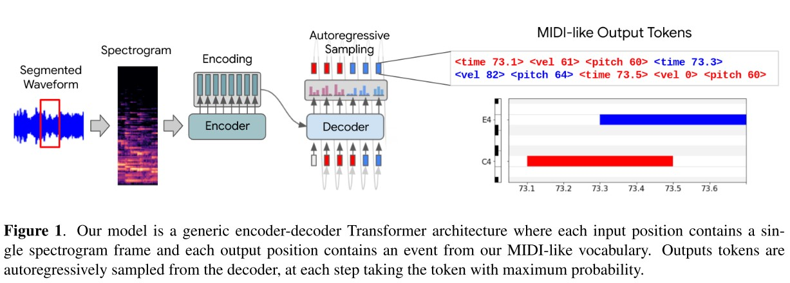

- Tokenize midi file as described in [SEQUENCE-TO-SEQUENCE PIANO TRANSCRIPTION WITH TRANSFORMERS](https://arxiv.org/abs/2107.09142)

- 

- I am not sure wheter decoding step is properly implemented.
- This repo will be provided as-is. No update is expected.

## Tokenizer
- Supports
    1. Tokenize mido object to midi tokens.
        ```python
        def midi_to_token_save(midi_file, tk_config):
            tokenizer = Tokenizer(tk_config)
            midofile = mido.MidiFile(midi_file)
            tokens = tokenizer.mido_to_token(midofile)
        ```
    2. Split the token sequence in the desired time range.
        ```python
        token_split = tokenizer.split(
            tokens,
            start_time,
            end_time,
        )
        ```
    3. Convert token sequence to a PrettyMidi object
    4. Binary velocity
